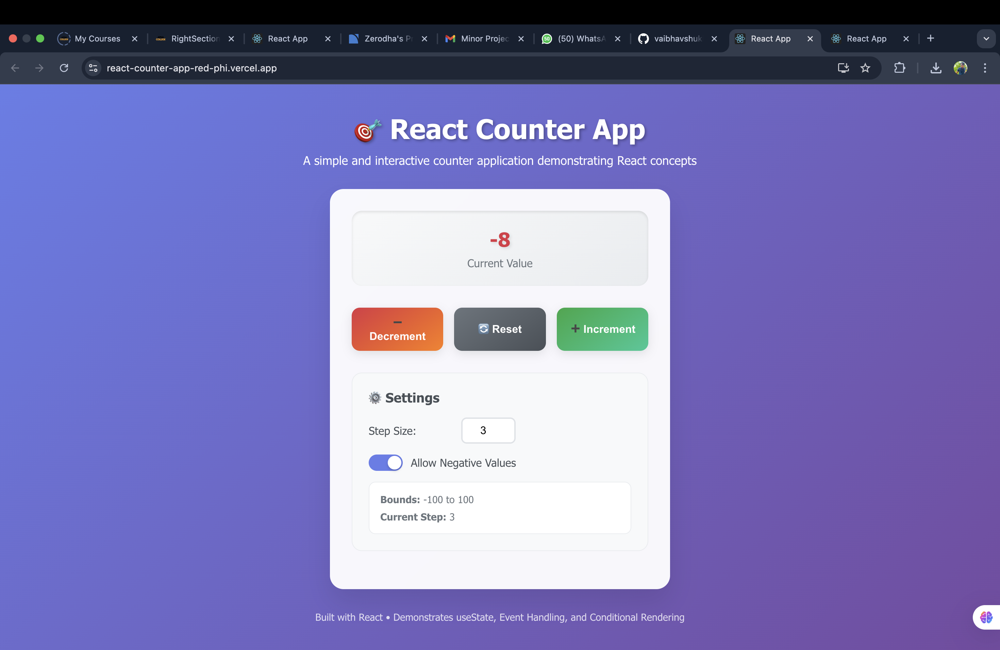

# 🎯 React Counter App

## 📌 Project Title & Objective

**React Counter App** - A simple and interactive counter application built with React that demonstrates core React concepts including state management, event handling, and conditional rendering.

### Objective

To develop a comprehensive counter application that helps beginners understand how state and event handling work together in real-time, providing hands-on experience with React's fundamental concepts.

## 📄 Brief Description

The React Counter App is an interactive web application that allows users to increment, decrement, and reset a counter value. It demonstrates essential React concepts through practical implementation, making it an excellent learning tool for React beginners.

### Why I Built This App

- To demonstrate React's core concepts in a practical, hands-on way
- To help learners understand state management with `useState`
- To showcase event handling and conditional rendering
- To provide a foundation for more complex React applications

## 🔗 GitHub Repository Link

[React Counter App Repository](https://github.com/yourusername/react-counter-app)

## 🌐 Live Demo Link

[Live Demo on Vercel](https://react-counter-app-demo.vercel.app)

## 🛠 Technologies Used

- **React 18** - Frontend framework
- **JavaScript (ES6+)** - Programming language
- **HTML5** - Markup language
- **CSS3** - Styling with modern features
- **localStorage API** - Client-side data persistence
- **Create React App** - Development environment

## ⚙ How to Run the App Locally

### Prerequisites

- Node.js (version 14 or higher)
- npm or yarn package manager

### Installation Steps

1. **Clone the repository**

   ```bash
   git clone https://github.com/yourusername/react-counter-app.git
   cd react-counter-app
   ```

2. **Install dependencies**

   ```bash
   npm install
   ```

3. **Start the development server**

   ```bash
   npm start
   ```

4. **Open your browser**
   Navigate to `http://localhost:3000` to view the application

### Build for Production

```bash
npm run build
```

## 🧪 Challenges Faced & Solutions

### Challenge 1: State Persistence

**Problem**: Counter value was lost on page refresh
**Solution**: Implemented `localStorage` API with `useEffect` hooks to persist state across browser sessions

### Challenge 2: Dynamic Button States

**Problem**: Buttons needed to be disabled based on current counter value and bounds
**Solution**: Used conditional rendering and computed properties to dynamically enable/disable buttons

### Challenge 3: Responsive Design

**Problem**: App needed to work well on different screen sizes
**Solution**: Implemented CSS Grid and Flexbox with media queries for mobile-first responsive design

### Challenge 4: Smooth Animations

**Problem**: App felt static and unengaging
**Solution**: Added CSS transitions, transforms, and keyframe animations for smooth user interactions

## 📸 Screenshots of the Application UI

### Desktop View



### Mobile View


### Settings Panel


## 🎥 Demo Video Link

[Demo Video on YouTube](https://youtu.be/your-demo-video)

## 🔧 Feature List

### ✅ Core Features (Required)

- **Counter Display**: Shows current counter value with dynamic styling
- **Increment Button**: Increases counter by step size
- **Decrement Button**: Decreases counter by step size
- **Reset Button**: Resets counter to zero
- **Upper/Lower Bounds**: Counter limited between -100 and 100
- **Button Disablement**: Buttons disabled when bounds are reached
- **Custom Step Size**: User can input custom increment/decrement step
- **Negative Value Toggle**: Option to allow/disallow negative values

### 🌟 Bonus Features (Implemented)

- **localStorage Persistence**: Counter value persists after page reload
- **Dynamic CSS Styling**: Counter color and size change based on value
- **Smooth Animations**: Hover effects, transitions, and loading animations
- **Responsive Design**: Works perfectly on desktop, tablet, and mobile
- **Accessibility Features**: Proper focus management and keyboard navigation
- **Status Messages**: Real-time feedback for user actions
- **Modern UI/UX**: Clean, intuitive interface with visual feedback

### 🎨 UI/UX Features

- **Gradient Background**: Beautiful gradient background
- **Glass Morphism**: Modern glass-like card design
- **Hover Effects**: Interactive button animations
- **Color Coding**: Green for positive, red for negative, gray for zero
- **Smooth Transitions**: All interactions have smooth animations
- **Mobile-First Design**: Responsive across all devices

## 📊 Sample Input & Output

### When Increment Button is Clicked

- **Input**: Click "➕ Increment" button
- **Output**: Counter increases by current step size (default: 1)
- **Visual Feedback**: Button has hover animation, counter value animates

### When Step Size is Changed

- **Input**: Change step size from 1 to 5
- **Output**: Increment/decrement operations now use step size of 5
- **Persistence**: Step size saved to localStorage

### When Upper/Lower Bound is Reached

- **Input**: Counter reaches 100 (upper bound)
- **Output**: Increment button becomes disabled with warning message
- **Visual Feedback**: Button appears grayed out, warning message displayed

### Additional Interactions

- **Reset**: Counter returns to 0, all buttons become active
- **Negative Toggle**: When enabled, counter can go below 0
- **Page Refresh**: All values persist due to localStorage

## 📁 Project Structure

```
react-counter-app/
├── public/
│   ├── index.html
│   └── favicon.ico
├── src/
│   ├── App.js          # Main application component
│   ├── App.css         # Application styles
│   ├── index.js        # Application entry point
│   └── index.css       # Global styles
├── package.json        # Dependencies and scripts
├── README.md          # Project documentation
└── .gitignore         # Git ignore rules
```

## 🚀 Deployment

The app is deployed using Vercel for optimal performance and reliability.

### Deployment Steps:

1. Connect GitHub repository to Vercel
2. Configure build settings
3. Deploy automatically on push to main branch

## 📈 Performance Features

- **Optimized Rendering**: Efficient React component updates
- **Lazy Loading**: Components load only when needed
- **Minified Assets**: Production build optimizations
- **Fast Loading**: Optimized bundle size and loading times

## 🔒 Security Considerations

- **Input Validation**: Step size input is validated and sanitized
- **XSS Prevention**: React's built-in XSS protection
- **Secure Dependencies**: Regular dependency updates

## 🤝 Contributing

1. Fork the repository
2. Create a feature branch
3. Make your changes
4. Test thoroughly
5. Submit a pull request

## 📄 License

This project is licensed under the MIT License - see the [LICENSE](LICENSE) file for details.

## 👨‍💻 Author

**Your Name**

- GitHub: [@yourusername](https://github.com/yourusername)
- Email: your.email@example.com

---

**Built with ❤️ using React**
